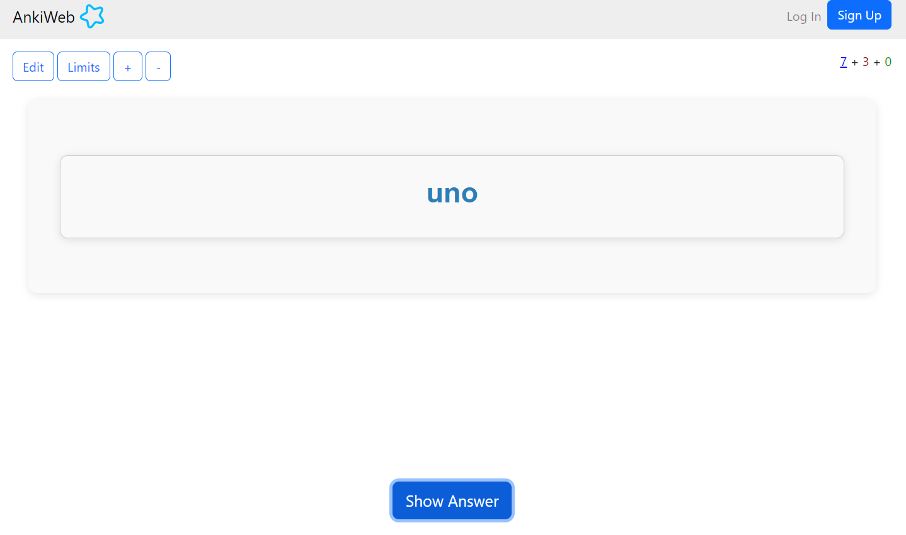
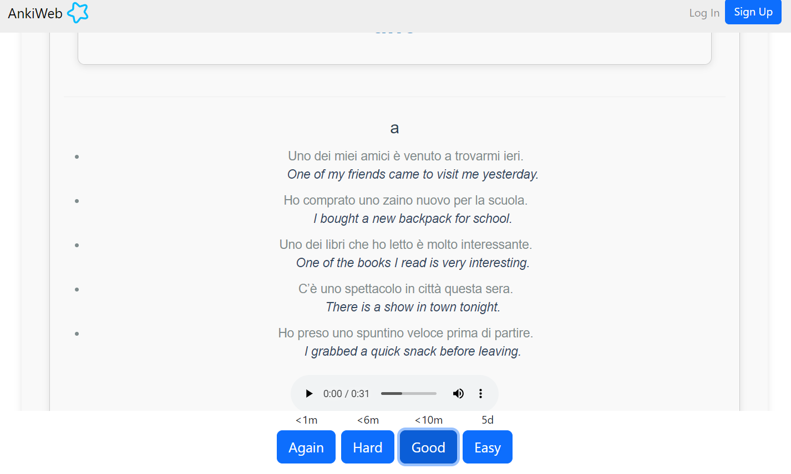

# 1000 Most Common Italian Words - Anki Deck

This repository contains a collection of the **1000 most common Italian words** along with their meanings, sample sentences, and audio. It is designed to help Italian learners practice vocabulary at the B1 level, with each word paired with **5 example sentences**.

The words and examples have been integrated into an Anki deck to facilitate efficient learning and revision.

## Features

- **1000 most common Italian words** sourced from: [Travel with Languages - Most Common Italian Words](https://travelwithlanguages.com/blog/most-common-italian-words.html)
- Each word is provided with:
  - **Meaning** in English
  - **5 example sentences** generated using ChatGPT 4.0 at B1 level proficiency
  - **Audio files** generated using Python and Google’s gTTS library for each word and sentence
- The flashcards are available in **Anki deck format**, making it easy to import and start learning right away.

## Flashcard Preview

Here is a preview of what the Anki flashcards look like:

### Front of the Flashcard (Italian Word)

### Back of the Flashcard (Meaning, Examples, Audio)

These flashcards include the Italian word on the front, and when flipped, the back contains the meaning, 5 example sentences, and the option to play audio for both the word and sentences.

## Customizations

This project is a fork of a previous repository, modified for **personal use**. Key changes and additions include:

1. **Audio Generation**: 
   - Python code with Google gTTS is used to generate separate audio files for each vocabulary word and its example sentences.

2. **Anki Deck Creation**:
   - The final output is an **Anki deck**, where each flashcard contains:
     - The word’s **meaning**
     - **5 example sentences**
     - The **audio file** for both the word and sentences

## How to Use

1. Download the **Anki deck** file from the repository.
2. Import it into Anki (if you don't have Anki, you can download it [here](https://apps.ankiweb.net/)).
3. Review the deck to learn the **most common Italian words**, practice pronunciation with the **audio**, and reinforce grammar with **example sentences**.

## Prerequisites

- **Anki** installed on your computer or mobile device
- Optional: Knowledge of B1 level Italian to understand example sentences more easily

## Resources and References

This repository was built with the help of the following resources:

- [Travel with Languages - Most Common Italian Words](https://travelwithlanguages.com/blog/most-common-italian-words.html)
- [Google gTTS (Google Text-to-Speech)](https://pypi.org/project/gTTS/)
- [Anki - Powerful, intelligent flashcards](https://apps.ankiweb.net/)
- [ChatGPT by OpenAI](https://openai.com/chatgpt)
- [JishoOrgToJlptAnki](https://github.com/pierreydumas/JishoOrgToJlptAnki)
- [genanki: A Library for Generating Anki Decks](https://github.com/kerrickstaley/genanki)
---

Hope this resource helps you in your journey to mastering Italian!
